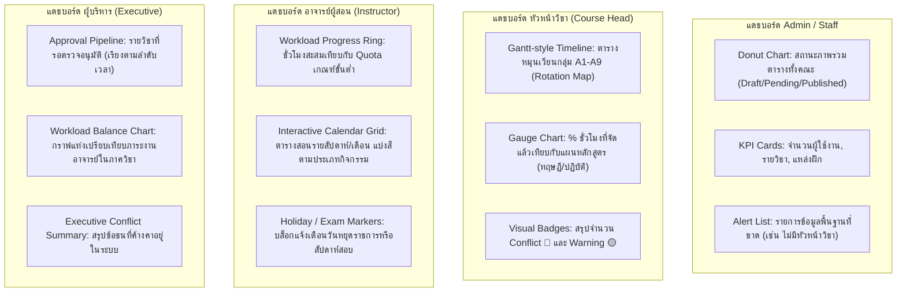

# สรุปขอบเขตและข้อกำหนดของระบบ TPSS

เอกสารนี้สรุปจากไฟล์ `รายละเอียดระบบ_V1ล่าสุด.docx` และข้อกำหนดความต้องการระบบเพิ่มเติม เพื่อใช้เป็นเอกสารทำความเข้าใจขอบเขตของระบบจัดตารางสอนและการฝึกปฏิบัติ (Teaching & Practicum Scheduling System: TPSS)

---

## 1. ภาพรวมของระบบ

TPSS เป็นระบบสำหรับบริหารจัดการตารางสอนและตารางฝึกปฏิบัติของคณะพยาบาลศาสตร์ โดยระยะแรกเน้นการจัดตารางในมุมของอาจารย์ผู้สอนก่อน เนื่องจากระยะเวลาดำเนินงานมีจำกัด จากนั้นข้อมูลที่ได้จากระบบส่วนนี้จะสามารถนำไปต่อยอดเป็นตารางเรียนของนักศึกษา และรายงานที่เกี่ยวข้องกับการคำนวณ PA-QA ในเฟสถัดไป

สาระสำคัญของระบบคือไม่ได้เป็นเพียงระบบจองห้องหรือทำตารางเรียนรายสัปดาห์แบบเดิม แต่เป็นระบบบริหารตารางการเรียนการสอนที่มีหลายกลุ่ม หลายกิจกรรม หลายสถานที่ หลายผู้สอน และมีรูปแบบการหมุนเวียนการฝึกปฏิบัติที่ซับซ้อน

> **หมายเหตุ**: ตารางสอนกับตารางเรียนเป็นข้อมูลชุดเดียวกัน ต่างกันแค่มุมมอง — ตารางสอนมองจากอาจารย์ ตารางเรียนมองจากนักศึกษา
>
> **ตัวอย่าง**: เมื่อบันทึกว่า "อ.สมศรี สอนวิชาการพยาบาลผู้ใหญ่ (NSBS 301) ให้กลุ่ม A1 ที่หอผู้ป่วยเพศชาย รพ.ศิริราช วันจันทร์ที่ 15 ก.ค. เวลา 8:00-16:00" ข้อมูลนี้จะปรากฏทั้ง:
> - **ตารางสอนของ อ.สมศรี**: วันจันทร์ 15 ก.ค. 8-16 น. → ฝึกปฏิบัติกลุ่ม A1 ที่หอผู้ป่วยเพศชาย
> - **ตารางเรียนของกลุ่ม A1**: วันจันทร์ 15 ก.ค. 8-16 น. → ฝึกปฏิบัติกับ อ.สมศรี ที่หอผู้ป่วยเพศชาย

---

## 2. ลักษณะตารางที่ระบบต้องรองรับ

ตารางของระบบนี้เป็น **Block Schedule** และ **Rotation Schedule** ไม่ใช่ timetable ที่คาบเรียนซ้ำเหมือนเดิมทุกสัปดาห์ รายวิชาหนึ่งอาจมีช่วงเรียนหรือฝึกต่อเนื่องหลายสัปดาห์ มีบางสัปดาห์ที่กิจกรรมเปลี่ยนไป มีวันหยุด กิจกรรมพิเศษ การสอบ การนำเสนอ หรือการ conference ที่ไม่ได้เกิดซ้ำเป็น pattern เดียวกัน

### 2.1 ลักษณะพิเศษของตาราง

| ลักษณะ | คำอธิบาย | ตัวอย่าง |
|--------|----------|----------|
| **Block Schedule** | ไม่ซ้ำรายสัปดาห์ แต่เป็น block ต่อเนื่องหลายสัปดาห์ | วิชาพยาบาลผู้ใหญ่ ฝึกต่อเนื่อง 8 สัปดาห์ (ก.ค.–ส.ค.) แต่ละสัปดาห์กิจกรรมอาจต่างกัน |
| **หลายกลุ่มย่อย** | 1 วิชา 270+ คน แบ่งเป็นหลายกลุ่มย่อย | วิชา NSBS 301 มี 270 คน แบ่งเป็น A1-A9 (กลุ่มละ 30 คน) |
| **Parallel Activities** | วันเดียวกัน แต่ละกลุ่มทำกิจกรรมต่างกัน | วันจันทร์ที่ 15 ก.ค.: กลุ่ม A1 ขึ้นวอร์ด, กลุ่ม A2 ทำ conference, กลุ่ม A3 เยี่ยมบ้าน |
| **Rotation Schedule** | กลุ่มหมุนเวียนระหว่างแหล่งฝึกและประเภทประสบการณ์ | สัปดาห์ 1-2: กลุ่ม A1 ฝึกหอเพศชาย → สัปดาห์ 3-4: กลุ่ม A1 ย้ายไปหอเพศหญิง |
| **Exception-based** | ตารางเปลี่ยนตามสัปดาห์ มีวันหยุด กิจกรรมพิเศษ | สัปดาห์ที่ 4 งดฝึกเพราะวันหยุดราชการ, สัปดาห์ที่ 8 เป็นสัปดาห์สอบ |

### 2.2 ตัวอย่าง Block Schedule ของปี 3 (เทอม 1 ช่วง 8 สัปดาห์)

```
วิชา NSBS 301 การพยาบาลผู้ใหญ่ 1 — ภาควิชาการพยาบาลอายุรศาสตร์
นักศึกษา 270 คน → แบ่งกลุ่มใหญ่ A (เทอม 1) / กลุ่ม B (เทอม 2)
กลุ่ม A แบ่งเป็น A1, A2, A3, A4, A5, A6, A7, A8, A9 (กลุ่มละ ~30 คน)

สัปดาห์ที่ 1:  ปฐมนิเทศ (ทุกกลุ่มรวม) — ห้องบรรยาย N301
สัปดาห์ที่ 2:  บรรยาย (ทุกกลุ่มรวม) — ห้องบรรยาย N301
สัปดาห์ที่ 3-6: ฝึกปฏิบัติ (แต่ละกลุ่มแยกไปตามจุดฝึก)
                 A1-A3 → หอผู้ป่วยเพศชาย รพ.ศิริราช (อ.สมศรี)
                 A4-A6 → หอผู้ป่วยเพศหญิง รพ.ศิริราช (อ.มานะ)
                 A7-A9 → รพ.ชุมชน (อ.วิชัย)
                 *หมายเหตุ: หากสัปดาห์ใดมีวันหยุดราชการ จะงดการเรียนการสอนในวันนั้น*
สัปดาห์ที่ 7:   สัปดาห์ที่ 3-6 สลับจุดฝึก (Rotation)
                 A1-A3 → หอผู้ป่วยเพศหญิง
                 A4-A6 → รพ.ชุมชน
                 A7-A9 → หอผู้ป่วยเพศชาย
สัปดาห์ที่ 8:   สอบกลางภาค + นำเสนอ case (ทุกกลุ่มรวม) — ห้องบรรยาย N301
```

> **สังเกต**: ตารางแต่ละสัปดาห์ไม่เหมือนกันเลย — นี่คือความแตกต่างจากตารางเรียนทั่วไปที่ซ้ำทุกสัปดาห์

### 2.3 การจัดการกลุ่มสลับเทอม (Semester Swapping) และโครงสร้างปี 3-4

นักศึกษาชั้นปีที่ 3-4 แบ่งเป็น 2 กลุ่มใหญ่ คือ **กลุ่ม A** และ **กลุ่ม B** ซึ่งในแต่ละเทอมจะสลับกันเรียนวิชาภาคปฏิบัติเพื่อไม่ให้จุดฝึกปฏิบัติ (เช่น หอผู้ป่วย) หนาแน่นจนเกินไป

- **ในเทอม 1**: กลุ่ม A เรียนวิชาปฏิบัติที่ 1 (เช่น NSBS 301 การพยาบาลผู้ใหญ่ 1) ส่วนกลุ่ม B เรียนวิชาอื่น (เช่น NSBS 302 การพยาบาลเด็ก 1)
- **ในเทอม 2**: กลุ่ม A และ B จะสลับวิชากัน (กลุ่ม B มาเรียน NSBS 301 ส่วนกลุ่ม A ไปเรียน NSBS 302)

```
ตัวอย่างโครงสร้างกลุ่มของปี 3:

นักศึกษาปี 3 ทั้งหมด 270 คน
├── กลุ่ม A (135 คน) — เรียนวิชา X ในเทอม 1 / สลับเรียนวิชา Y ในเทอม 2
│   ├── A1 (30 คน)
│   ├── A2 (30 คน)
│   ├── ...
│   └── A9 (15 คน)
└── กลุ่ม B (135 คน) — เรียนวิชา Y ในเทอม 1 / สลับเรียนวิชา X ในเทอม 2
    ├── B1 (30 คน)
    ├── B2 (30 คน)
    ├── ...
    └── B9 (15 คน)
```

ใน 1 ช่วงเวลา ประมาณ 8-9 สัปดาห์ ของชั้นปีที่ 3-4 อาจมีทั้งรายวิชาภาคทฤษฎีและภาคปฏิบัติอยู่ร่วมกัน โดยมี 1 ภาควิชารับผิดชอบ วิธีบริหารจัดการอาจเป็นได้ทั้งเรียนทฤษฎีก่อนแล้วขึ้นฝึกยาว หรือเรียนทฤษฎีและฝึกปฏิบัติสลับกันไป ขึ้นกับรูปแบบของแต่ละภาควิชา

### 2.4 การจัดการวันหยุดราชการและช่วงเวลาสอบ (Public Holidays & Exam Periods)

ระบบจะต้องรองรับการจัดการข้อยกเว้นและวันสำคัญทางวิชาการ ดังนี้:

1. **วันหยุดราชการ / วันหยุดนักขัตฤกษ์ (Public Holidays)**:
   - ต้องระบุวันหยุดลงในปฏิทินของระบบได้
   - ในวันหยุดราชการ จะต้องแสดงสถานะหรือหมายเหตุอย่างชัดเจนว่า **"วันหยุดทำการเรียนการสอน"**
   - เมื่อมีการบันทึกหรือเจนตารางสอนที่ตรงกับวันหยุด ระบบจะต้องแสดงหมายเหตุงดการเรียนการสอนบนตารางปฏิทิน และแจ้งเตือนผู้จัดตาราง
   - กิจกรรมที่ตรงกับวันหยุดราชการจะไม่ถูกนำมาคำนวณเป็นภาระงานของอาจารย์ผู้สอน (ยกเว้นกรณีมีการสอนชดเชยตามประกาศพิเศษ)
2. **การกำหนดวันสอบกลางภาคและปลายภาค (Midterm & Final Exam Dates)**:
   - ต้องมีฟังก์ชันระบุช่วงสัปดาห์หรือวันที่จัดสอบกลางภาคและสอบปลายภาคอย่างชัดเจนในปฏิทินการศึกษา
   - ในช่วงสัปดาห์สอบ กิจกรรมเรียนการสอนปกติจะถูกงดเว้น และแทนที่ด้วยกิจกรรมการสอบ
   - กิจกรรมการสอบจะไม่มีการคำนวณภาระงานสอนปกติ แต่อาจแสดงข้อมูลภาระการคุมสอบแยกต่างหาก

---

## 3. รูปแบบการเรียนและการหมุนเวียน

ระบบต้องรองรับหลายรูปแบบการเรียนในรายวิชาเดียวกัน:

| รูปแบบ | ตัวอย่าง |
|--------|----------|
| เรียนทฤษฎีอย่างเดียว | วิชาจริยศาสตร์ — บรรยายทุกอังคาร 9-12 น. ตลอดเทอม |
| ฝึกปฏิบัติอย่างเดียว | วิชาฝึกปฏิบัติชุมชน — ไปชุมชนต่อเนื่อง 6 สัปดาห์ |
| มีทั้งทฤษฎีและปฏิบัติ | บรรยาย 2 สัปดาห์แรก → ฝึกปฏิบัติ 6 สัปดาห์ → สอบ 1 สัปดาห์ |
| จัดทั้ง 2 เทอม | กลุ่ม A เรียนเทอม 1 / กลุ่ม B เรียนเทอม 2 (วิชาเดียวกัน) |
| สลับกลุ่มภายในเทอม | สัปดาห์ 1-4: A1 ฝึก A2 บรรยาย → สัปดาห์ 5-8: A1 บรรยาย A2 ฝึก |
| กิจกรรมหลายชุดพร้อมกัน | วันเดียวกัน: กลุ่ม 1 อยู่หอผู้ป่วย, กลุ่ม 2 ทำ conference, กลุ่ม 3 ไป รพ.สต. |

### 3.1 ตัวอย่าง Rotation Schedule

```
วิชา NSBS 301: ฝึกปฏิบัติสัปดาห์ที่ 3-6 (4 สัปดาห์ หมุนเวียน)

              สัปดาห์ 3    สัปดาห์ 4    สัปดาห์ 5    สัปดาห์ 6
กลุ่ม A1-A3   หอเพศชาย    หอเพศชาย    หอเพศหญิง   หอเพศหญิง
              (อ.สมศรี)    (อ.สมศรี)    (อ.มานะ)     (อ.มานะ)

กลุ่ม A4-A6   หอเพศหญิง   หอเพศหญิง   รพ.ชุมชน     รพ.ชุมชน
              (อ.มานะ)     (อ.มานะ)     (อ.วิชัย)    (อ.วิชัย)

กลุ่ม A7-A9   รพ.ชุมชน     รพ.ชุมชน    หอเพศชาย    หอเพศชาย
              (อ.วิชัย)    (อ.วิชัย)    (อ.สมศรี)    (อ.สมศรี)
```

> **สิ่งที่ระบบต้องตรวจ**: เมื่อ อ.สมศรี ย้ายจากดูแลกลุ่ม A1-A3 ไปดูแลกลุ่ม A7-A9 ในสัปดาห์ที่ 5 ระบบต้องตรวจว่าช่วงเวลานั้น อ.สมศรี ไม่ได้ถูกจัดสอนวิชาอื่นซ้อนอยู่

### 3.2 สถานที่

สถานที่ไม่ได้จำกัดเฉพาะห้องเรียน แต่รวมถึงห้องปฏิบัติการ LRC แหล่งฝึก โรงพยาบาล หอผู้ป่วย ชุมชน รพ.สต. ศูนย์พัฒนาเด็ก โรงเรียน ห้อง conference และกิจกรรม online ด้วย

> **สถานที่แบบ "ใช้ร่วมกันได้"**: บางสถานที่ เช่น โรงพยาบาลศิริราช, ชุมชน, สนามฝึก มีขนาดใหญ่พอให้หลายวิชาใช้พร้อมกันได้ ระบบจะไม่ตรวจ conflict การใช้ห้องซ้อนและไม่ตรวจความจุสำหรับสถานที่ประเภทนี้ (Admin กำหนดได้ว่าประเภทสถานที่ใดเป็นแบบใช้ร่วมกันได้)
>
> **ตัวอย่าง**:
> - ห้องบรรยาย N301 (ความจุ 50 คน) → **ใช้ร่วมไม่ได้** → ถ้า 2 วิชาจองเวลาเดียวกัน = Conflict 🔴
> - โรงพยาบาลศิริราช → **ใช้ร่วมได้** → วิชาพยาบาลผู้ใหญ่ + วิชาพยาบาลเด็ก ฝึกที่ รพ. เดียวกันพร้อมกันได้ ✅

---

## 4. ขอบเขตหลักของระบบระยะแรก (V1)

ขอบเขตหลักที่ควรจัดให้ชัดใน V1 คือการให้หัวหน้าวิชาหรือผู้ประสานรายวิชาบันทึกตารางเองได้สะดวก โดยระบบช่วยตรวจสอบความถูกต้องและสรุปผล ไม่จำเป็นต้องให้ระบบสร้างตารางอัตโนมัติเต็มรูปแบบตั้งแต่แรก

### 4.1 ฟังก์ชันหลักที่ต้องมี

- จัดการข้อมูลพื้นฐาน เช่น ปีการศึกษา ภาคการศึกษา หลักสูตร รายวิชา อาจารย์ กลุ่มนักศึกษา สถานที่ และประเภทกิจกรรม
- บันทึกรายการตารางสอนและตารางฝึกปฏิบัติทีละรายการ
- คัดลอกรายการตารางเดิมเพื่อลดการกรอกซ้ำ
- แก้ไข ลบ และเปลี่ยนสถานะรายการตารางตามสิทธิ์
- ตรวจสอบตารางชนของอาจารย์ กลุ่มนักศึกษา และสถานที่ ทั้งภายในวิชาเดียวกันและข้ามวิชาทั้งคณะ
- แจ้งเตือนข้อมูลผิดปกติ
- สรุปภาระงานอาจารย์เป็นรายบุคคล รายวิชา ประเภทกิจกรรม และระดับการศึกษา
- แสดง Dashboard ตามบทบาทผู้ใช้ ให้เห็นภาพรวมสถานะของตัวเอง
- ออกรายงานและส่งออกเป็น PDF/Excel โดยเฉพาะ PDF ตารางรายวิชาเพื่อแจกนักศึกษาได้ทันที

### 4.2 การตรวจสอบ 2 ระดับ: Conflict vs Warning

ระบบแยกการแจ้งเตือนเป็น 2 ระดับชัดเจน ซึ่งเป็นหัวใจของระบบ:

| ประเภท | พฤติกรรม | ตัวอย่าง |
|--------|----------|----------|
| **Conflict (ข้อชน)** 🔴 | **บันทึกไม่ได้** จนกว่าจะแก้ | ดูตัวอย่างด้านล่าง |
| **Warning (ข้อเตือน)** 🟡 | **บันทึกได้** แต่แสดงเตือนตลอด | ดูตัวอย่างด้านล่าง |

**ตัวอย่าง Conflict 🔴 (บันทึกไม่ได้)**:
```
หัวหน้าวิชา NSBS 301 จัดให้:
  อ.สมศรี สอนกลุ่ม A1 วันจันทร์ 15 ก.ค. เวลา 8-12 น. ที่หอผู้ป่วยเพศชาย

แต่หัวหน้าวิชา NSBS 401 ก็จัดให้:
  อ.สมศรี สอนกลุ่ม B2 วันจันทร์ 15 ก.ค. เวลา 9-16 น. ที่ รพ.ชุมชน

→ ระบบแจ้ง: "อ.สมศรี ถูกจัดสอนซ้อนเวลา (9-12 น.) ข้ามวิชา NSBS 301 กับ NSBS 401"
→ บันทึกไม่ได้จนกว่าจะแก้ให้ไม่ชนกัน
```

**ตัวอย่าง Warning 🟡 (บันทึกได้ แต่เตือน)**:
```
หัวหน้าวิชาบันทึก:
  กิจกรรม "ฝึกปฏิบัติ" กลุ่ม A1 วันจันทร์ 15 ก.ค. — ยังไม่ระบุผู้สอน

→ ระบบแจ้งเตือน: "ยังไม่ระบุอาจารย์ผู้สอน"
→ บันทึกได้ แต่จะมี badge เตือนสีเหลืองตลอดจนกว่าจะเพิ่มอาจารย์
```

การตรวจ Conflict รองรับทั้ง 2 แบบ:
- **ภายในวิชาเดียวกัน (In-course)** — ตรวจทันทีตอนบันทึก ถ้าชนก็บันทึกไม่ได้
- **ข้ามวิชาทั้งคณะ (Cross-course)** — ใช้รหัสประจำตัวอาจารย์ (Global Instructor ID) ตรวจว่าอาจารย์คนเดียวกันหรือห้องเดียวกันถูกจัดซ้อนในวิชาอื่นหรือไม่

---

## 5. โครงสร้างข้อมูลสำคัญที่ระบบต้องเก็บ

### 5.1 หลักสูตร (Curriculum)

ระบบเก็บหลักสูตรเป็นตัวเชื่อมหลัก โดยรองรับหลักสูตร ป.ตรี ป.โท และ ป.เอก สามารถ clone หลักสูตรเมื่อมีการปรับปรุง (เช่น ฉบับ พ.ศ. 2565 → 2570) โดยไม่กระทบข้อมูลเดิม

หลักสูตร ป.ตรี ใช้ระบบชั้นปี (ปี 1-4) ส่วน ป.โท/ป.เอก ใช้ระบบ prerequisite + หน่วยกิตสะสมแทน

```
ตัวอย่าง:
- หลักสูตร พย.บ. (ฉบับปรับปรุง พ.ศ. 2565) — ป.ตรี 4 ปี, ระบบชั้นปี
- หลักสูตร พย.ม. สาขาการพยาบาลผู้ใหญ่ (พ.ศ. 2565) — ป.โท 2 ปี, ระบบหน่วยกิตสะสม
- หลักสูตร ปร.ด. สาขาพยาบาลศาสตร์ (พ.ศ. 2565) — ป.เอก 3 ปี, ระบบหน่วยกิตสะสม
```

### 5.2 รายวิชา — โครงสร้าง 2 ชั้น

ข้อมูลรายวิชาในระบบแบ่งเป็น **2 ระดับ**:

```
หลักสูตร พย.บ. (ฉบับปรับปรุง พ.ศ. 2565)
  └── วิชา NSBS 301 การพยาบาลผู้ใหญ่ 1 (Course — ข้อมูลถาวร)
        │   หัวหน้าวิชา: อ.สมศรี
        │   หน่วยกิต: 3(2-3-4) · บรรยาย 30 ชม. / ปฏิบัติ 45 ชม.
        │
        └── เปิดสอน "ปีการศึกษา 2568" (Course Offering — ราย "ปี" สร้างใหม่ทุกปี)
              │   ★ ผู้บริหารอนุมัติทีเดียว "ทั้งปี"
              ├── ชุดอาจารย์ทั้งปี (superset): อ.สมศรี (หัวหน้า), อ.มานะ, อ.วิชัย, อ.สุดา, อ.ประเสริฐ
              ├── เทอม 1 → กลุ่ม A (A1-A9) — ตารางสอนของเทอม 1
              └── เทอม 2 → กลุ่ม B (B1-B9) — ตารางสอนของเทอม 2  ← สลับกลุ่ม
                    * แต่ละรายการตาราง (slot) ติดป้าย "เทอม + กลุ่ม"
                    * เทอม 2 เปลี่ยนอาจารย์/เวลาได้ โดยไม่กระทบเทอม 1
```

- **ข้อมูลวิชาหลัก (Course)**: เก็บรหัสวิชา ชื่อวิชา ประเภทวิชา หน่วยกิต ชั่วโมงตามแผน หัวหน้าวิชา เลขานุการวิชา เป็นข้อมูลที่ไม่เปลี่ยนตามปีการศึกษา
- **วิชาที่เปิดสอน (Course Offering)**: สร้างใหม่ทุก **ปีการศึกษา (ราย-ปี — 1 วิชา 1 offering ต่อปี)** โดย sync จาก Course หลักอัตโนมัติ แล้วจึงเพิ่มกลุ่มนักศึกษา อาจารย์ประจำวิชา และตารางสอน — วิชาเปิด **ทั้งปี** ส่วน "เทอม" เป็นป้ายกำกับของแต่ละรายการตาราง (ดูข้อ 2.3 การสลับกลุ่ม A/B)

> **ทำไม offering เป็นราย-ปี (ไม่ใช่ราย-เทอม)**: ผู้บริหารอนุมัติวิชานั้นทีเดียวทั้งปี ไม่ต้องอนุมัติซ้ำ 2 รอบ · การสลับกลุ่ม A (เทอม 1) ↔ B (เทอม 2) อยู่ใน offering ปีเดียวกัน โดยแต่ละรายการตารางติดป้ายเทอม+กลุ่ม
>
> **ทำไมต้องแยก 2 ชั้น (Course / Offering)**: ถ้า อ.สมศรี ลาออกจากการเป็นหัวหน้าวิชา → แก้ที่ Course (ข้อมูลถาวร) → มีผลทุกปีถัดไป · แต่ถ้าปีนี้ อ.มานะ มาช่วยสอนแทนชั่วคราว → แก้ที่ Course Offering → มีผลเฉพาะปีนี้

### 5.3 ชุดอาจารย์ประจำวิชา (Instructor Pool) — 2 ชั้น

ระบบเก็บชุดอาจารย์เป็น 2 ชั้นเช่นกัน:
1. **Template ระดับวิชา (Course-level)** — Admin/Staff จัดเตรียมไว้เป็น default ว่าวิชานี้มีอาจารย์คนไหนบ้าง พร้อมบทบาท (อาจารย์ผู้สอน, อาจารย์ประจำกลุ่ม, อาจารย์พี่เลี้ยง ฯลฯ)
2. **Snapshot ระดับ Offering** — ถูก sync จาก template เมื่อเปิดช่วงจัดตาราง หัวหน้าวิชาแก้ไขได้เฉพาะระดับนี้

```
ตัวอย่าง:

Template ระดับวิชา (NSBS 301):            Snapshot ระดับ Offering (ปีการศึกษา 2568):
├── อ.สมศรี (หัวหน้าวิชา)                  ├── อ.สมศรี (หัวหน้าวิชา) ← sync มา
├── อ.มานะ (อาจารย์ผู้สอน)                 ├── อ.มานะ (อาจารย์ผู้สอน) ← sync มา
├── อ.วิชัย (อาจารย์ผู้สอน)                 ├── อ.วิชัย (อาจารย์ผู้สอน) ← sync มา
└── อ.สุดา (อาจารย์พี่เลี้ยง)               ├── อ.สุดา (อาจารย์พี่เลี้ยง) ← sync มา
                                            └── อ.ประเสริฐ (อาจารย์ผู้สอน) ← หัวหน้าวิชาเพิ่มเอง
```

> เมื่อ offering เข้าสู่ช่วงจัดตารางแล้ว **template จะถูกล็อก**ไม่ให้แก้ไข เพื่อป้องกันข้อมูลไม่ตรงกัน

### 5.4 ประเภทกิจกรรม

ข้อมูลกิจกรรมควรรองรับอย่างน้อย:

| ประเภทกิจกรรม | นับภาระงาน? | ตัวอย่างการใช้ |
|--------------|------------|---------------|
| ปฐมนิเทศ | ❌ ไม่นับ | วันแรกของวิชา แนะนำรายวิชา ชี้แจงกฎ |
| บรรยาย | ✅ นับ | สอนทฤษฎีในห้องเรียน |
| Lab | ✅ นับ | ฝึกปฏิบัติในห้อง LRC |
| SDL | ❌ ไม่นับ | นักศึกษาเรียนรู้ด้วยตนเอง |
| กลุ่มย่อย | ✅ นับ | อภิปรายกลุ่มเล็ก |
| ฝึกปฏิบัติ | ✅ นับ | ขึ้นฝึกที่หอผู้ป่วย/ชุมชน |
| Conference | ✅ นับ | ประชุมปรึกษาเคส |
| Post-conference | ✅ นับ | สรุปหลังฝึก |
| สอบ | ❌ ไม่นับ | สอบกลางภาค/ปลายภาค |
| วันหยุด | ❌ ไม่นับ | วันหยุดราชการ |
| กิจกรรมพิเศษ | ❌ ไม่นับ | งานกาชาด กิจกรรมคณะ |
| วิทยานิพนธ์/ดุษฎีนิพนธ์ | ✅ นับ | สำหรับ ป.โท-เอก |

> **สำคัญ**: การนับ/ไม่นับภาระงานไม่ได้ตายตัว — Admin กำหนดได้ผ่านระบบว่าประเภทไหนนับ ประเภทไหนไม่นับ

### 5.5 กลุ่มนักศึกษา

แม้ V1 ยังไม่เปิดให้นักศึกษาเข้าใช้ระบบ แต่ **กลุ่มนักศึกษา** จำเป็นต้องเก็บตั้งแต่ V1 เพราะ:
- ต้องรู้ว่ากิจกรรมนี้สอน "กลุ่มไหน" เพื่อตรวจว่ากลุ่มเดียวกันถูกจัดซ้อนหรือไม่
- ภาระงานอาจารย์ต้องมีบริบท (สอนกี่กลุ่ม กลุ่มละกี่คน)
- Rotation/Block Schedule ผูกกับกลุ่ม
- รายงาน PDF ตารางรายวิชาต้องแสดงว่ากลุ่มไหนทำอะไรเมื่อไร

> ระบบไม่ได้ track นักศึกษารายคน (ไม่ต้องรู้ว่า "นายสมชาย" อยู่กลุ่มไหน) แต่ track เป็น "กลุ่ม A1 มี 30 คน" เท่านั้น

---

## 6. ผู้ใช้งานและสิทธิ์

ระบบมี **5 บทบาท** โดยผู้ใช้ 1 คนอาจมีหลายบทบาทได้ — ระบบรองรับการสลับบทบาท

| บทบาท | สิทธิ์หลัก | ตัวอย่างผู้ใช้ |
|--------|----------|--------------|
| **ผู้ดูแลระบบ (Admin)** | จัดการข้อมูลทั้งหมด ตั้งค่าระบบ เปิด-ปิดช่วงจัดตาราง จัดการผู้ใช้งาน | เจ้าหน้าที่ IT ฝ่ายการศึกษา |
| **เจ้าหน้าที่ (Staff)** | ช่วยกรอกข้อมูลพื้นฐาน ออกรายงาน (เหมือน Admin แต่จำกัดบางเมนู) | เจ้าหน้าที่ธุรการภาควิชา |
| **หัวหน้าวิชา (Course Head)** | จัดตารางของวิชาที่รับผิดชอบ ตรวจ conflict ส่งอนุมัติ จัดการกลุ่มและอาจารย์ในวิชา | อ.สมศรี (หัวหน้าวิชา NSBS 301) |
| **ผู้บริหาร (Executive)** | **ดูภาพรวมอย่างเดียว** + อนุมัติ/ปฏิเสธตาราง **ห้ามแก้ไข** | หัวหน้าภาควิชา, รองคณบดีฝ่ายการศึกษา |
| **อาจารย์ผู้สอน (Instructor)** | ดูตารางของตนเอง ดูภาระงาน และกิจกรรมที่ได้รับมอบหมาย | อ.มานะ (สอนใน NSBS 301) |

> **ตัวอย่าง Multi-Role**: อ.สมศรี อาจมี 2 บทบาทในระบบ:
> - เป็น **Course Head** ของวิชา NSBS 301 (จัดตาราง+ดูภาระงาน)
> - เป็น **Instructor** ของวิชา NSBS 401 (ดูตารางที่ถูกมอบหมายอย่างเดียว)
>
> อ.สมศรี สามารถสลับ role ผ่าน dropdown ใน sidebar ได้ทันที

---

## 7. Workflow การทำงาน

ระบบมี **2 ชั้น status** ที่ควบคุม workflow ทั้งหมด:

```
ชั้น 1 — ระดับระบบ (Admin ควบคุม):
  เตรียมข้อมูล → เปิดช่วงจัดตาราง → เผยแพร่
  (preparation)    (scheduling)        (published)

ชั้น 2 — ระดับรายวิชา (Course Head + Executive):
  แบบร่าง → ส่งอนุมัติ → อนุมัติ/ปฏิเสธ
  (draft)    (pending)    (published/rejected)
```

**ลำดับขั้นตอนการทำงาน:**

```
                  ┌─── Admin ───┐           ┌──── Course Head ────┐         ┌── Executive ──┐
                  │              │           │                      │         │                │
 1. เตรียมข้อมูล ──→ 2. ตรวจ ──→ 3. เปิดช่วง ──→ 4. ตั้งค่า ──→ 5. กรอก ──→ 9. ส่งอนุมัติ ──→ 10. อนุมัติ
    พื้นฐาน         Alerts       จัดตาราง      Offering      ตาราง                              /ปฏิเสธ
                                                              │
                                                         6. ตรวจ Conflict ←─── 7. แก้ไข
                                                              │                     ↑
                                                              └──── ชนอยู่ ─────────┘
                                                              │
                                                              └──── ผ่าน ──→ 8. ดู Dashboard
```

รายละเอียดแต่ละขั้น:

1. **Admin เตรียมข้อมูลพื้นฐาน** — ปีการศึกษา ภาคการศึกษา หลักสูตร รายวิชา อาจารย์ สถานที่ ประเภทกิจกรรม ชุดอาจารย์ประจำวิชา (Course Pool)
2. **Admin ตรวจ Critical Alerts** — ระบบแจ้งเตือนปัญหาที่ต้องแก้ก่อน เช่น วิชายังไม่มีหัวหน้า, ไม่มีวิชาที่ active — ต้องแก้ให้หมดก่อนเปิดช่วงจัดตาราง
3. **Admin เปิดช่วงจัดตาราง** — ระบบสร้าง Course Offering อัตโนมัติ + sync ข้อมูลจาก template (ชั่วโมง, ความจุ, ชุดอาจารย์)
4. **หัวหน้าวิชาตั้งค่า Offering** — เพิ่ม/แก้ไขกลุ่มนักศึกษา ปรับชุดอาจารย์ประจำวิชา
5. **หัวหน้าวิชากรอกตารางสอน/ฝึกปฏิบัติ** — ทีละรายการ ระบุวันที่ เวลา สถานที่ ผู้สอน กลุ่ม ประเภทกิจกรรม
6. **ระบบตรวจ Conflict/Warning ทันที** — ตอนบันทึกแต่ละรายการ Conflict = บันทึกไม่ได้, Warning = บันทึกได้แต่เตือน
7. **แก้ไขซ้ำจนไม่มี Conflict** — หัวหน้าวิชาปรับตารางจนผ่าน
8. **ตรวจภาพรวมผ่าน Dashboard** — ตารางครบ กลุ่มครบ กิจกรรมครบ ภาระงานสมดุล
9. **ส่งอนุมัติ** — สถานะ draft → pending
10. **ผู้บริหาร (Executive) อนุมัติหรือปฏิเสธ** — ดูอย่างเดียว + approve/reject พร้อมเหตุผล
11. **เผยแพร่ตาราง** — ตารางที่อนุมัติแล้วเผยแพร่ให้ผู้เกี่ยวข้อง
12. **ระหว่างภาคสามารถปรับแก้** — เปลี่ยนสถานะเป็น Revised และเก็บประวัติการแก้ไข

---

## 8. Dashboard และรายงาน

### 8.1 การปรับปรุง Dashboard ให้แสดงผลเชิงภาพ (Visual Dashboard Design)

จากการทบทวนความต้องการพบว่า Dashboard เดิมมีลักษณะเป็น "ข้อความรายการยาวพืด (Text Wall)" ซึ่งทำให้ยากต่อการจับประเด็นและเข้าใจภาพรวมในทันที ระบบ TPSS จะปรับปรุง Dashboard ของแต่ละบทบาท (Role) โดยการเปลี่ยนข้อความธรรมดาให้กลายเป็น **แผนภูมิ (Charts), แถบความคืบหน้า (Progress Bars), เกจวัด (Gauges) และเส้นเวลา (Timelines)** ที่แสดงผลได้สวยงาม สบายตา และเข้าใจข้อมูลได้ทันทีใน 3 วินาที



---

#### 1) Dashboard สำหรับ ผู้ดูแลระบบ (Admin) และ เจ้าหน้าที่ (Staff)
*เน้นความคืบหน้าของงานจัดตารางและการจัดการข้อมูลพื้นฐานของทั้งคณะ*

*   **Donut Chart (แผนภูมิวงกลม):** แสดงความคืบหน้าของตารางสอนรายวิชาทั้งหมดในคณะแบ่งตามสถานะ (`Draft` / `Pending Approval` / `Published` / `Rejected`) เพื่อให้มองเห็นทันทีว่าภาพรวมการจัดตารางเสร็จสิ้นไปกี่เปอร์เซ็นต์
*   **KPI Cards (การ์ดดัชนีชี้วัด):** แสดงตัวเลขสถิติสำคัญในกริดที่สวยงาม เช่น จำนวนรายวิชาทั้งหมด, จำนวนอาจารย์ active, จำนวนห้องเรียน/สถานที่ฝึกปฏิบัติ พร้อมไอคอนสีสันสดใส
*   **Critical Alerts Grid (รายการเตือนระดับวิกฤต):** การ์ดสีแดงแสดงวิชาที่ "ยังไม่ได้ระบุหัวหน้าวิชา" หรือ "ไม่มีผู้สอน" เพื่อชี้เป้าให้เจ้าหน้าที่เข้าไปแก้ไขข้อมูลตั้งต้นได้ทันที
*   **Recent Audit Log Feed:** ตารางประวัติการทำงานล่าสุดของผู้ใช้ในระบบแบบกะทัดรัด (เช่น "อ.สมศรี ปรับปรุงตาราง NSBS 301") พร้อมลิงก์ดูรายละเอียดทั้งหมด

---

#### 2) Dashboard สำหรับ หัวหน้าวิชา (Course Head)
*เน้นความสมบูรณ์ของรายวิชาตนเอง, การกระจายตัวของกลุ่มนักศึกษา และการตรวจจับข้อผิดพลาด*

*   **Rotation Timeline Map (แผนภูมิแกนต์จำลองการฝึกปฏิบัติ):** 
    *   แสดงตารางหมุนเวียนกลุ่มย่อย (เช่น A1 - A9) และสัปดาห์การเรียน/ฝึกปฏิบัติ (1 - 8) ในรูปแบบแถบสี (Gantt Chart) 
    *   เช่น แถบสีแดงสำหรับ "ฝึกวอร์ดเพศชาย รพ.ศิริราช", สีเขียวสำหรับ "รพ.ชุมชน" และสีน้ำเงินสำหรับ "บรรยาย" 
    *   ช่วยให้หัวหน้าวิชาตรวจสอบได้ในพริบตาว่ากลุ่มนักศึกษาทั้งหมดได้รับการกระจายจุดฝึกอย่างสม่ำเสมอ ไม่มีกลุ่มใดหลงลืมหรือจุดฝึกใดทับซ้อนกัน
*   **Curriculum Requirement Gauge (เกจวัดความคืบหน้าชั่วโมงสอน):** 
    *   แสดงแถบความคืบหน้าเป็นเปอร์เซ็นต์ของจำนวนชั่วโมงที่จัดตารางไปแล้ว เทียบกับเกณฑ์ชั่วโมงที่กำหนดไว้ในหลักสูตร 
    *   แยกเป็น **ภาคทฤษฎี** (เช่น จัดแล้ว 30/30 ชั่วโมง = 100%) และ **ภาคปฏิบัติ** (เช่น จัดแล้ว 40/45 ชั่วโมง = 88%)
*   **Interactive Conflict / Warning Indicators:** 
    *   กล่องแสดงตัวเลขอันใหญ่สีแดง 🔴 (Conflict) และสีส้ม 🟡 (Warning) 
    *   เมื่อคลิกแล้วจะสไลด์แถบด้านข้างแสดงรายการที่ชนและลิงก์เชื่อมต่อไปยังปฏิทินวันนั้นเพื่อแก้ไขได้ทันที

---

#### 3) Dashboard สำหรับ อาจารย์ผู้สอน (Instructor)
*เน้นการติดตามตารางสอนของตนเอง และเกณฑ์ภาระงานสอนสะสม*

*   **Workload Gauge (เกจภาระงานสะสมเทียบกับ Quota):** 
    *   แสดงแถบเกจชั่วโมงภาระงานสอนจริงที่บันทึกแล้วในภาคการศึกษาปัจจุบัน เทียบกับเกณฑ์ภาระงานขั้นต่ำ (Quota) ของอาจารย์ (เช่น 35 ชั่วโมง/สัปดาห์ หรือโควตาประจำรอบประเมิน)
    *   ใช้แถบสีช่วยระบุ: **สีเหลือง** (ชั่วโมงยังไม่ถึงเกณฑ์ขั้นต่ำ), **สีเขียว** (ชั่วโมงอยู่ในเกณฑ์ที่เหมาะสม), **สีแดง** (ชั่วโมงเกินเพดานสูงสุด)
*   **Visual Calendar Grid (ปฏิทินตารางสอนส่วนบุคคล):** 
    *   ปฏิทินที่รองรับมุมมองรายเดือน/รายสัปดาห์ โดยในแต่ละวันมีบล็อกกิจกรรมที่ลงสีและไอคอนตามประเภท (บรรยาย = น้ำเงิน, ฝึกปฏิบัติ = แดง, สอบ = เทาเข้ม)
    *   **Public Holiday Marker:** หากวันดังกล่าวตรงกับวันหยุดราชการ บล็อกในปฏิทินจะเป็นสีเทาคาดเฉียงและแสดงข้อความเด่นชัด เช่น *"หยุดทำการเรียนการสอน (วันปิยมหาราช)"*
    *   **Exam Period Badge:** สัปดาห์ที่เป็นช่วงสอบจะถูกเน้นสีขอบปฏิทินเป็นสีพิเศษ (เช่น สีส้มเข้ม) พร้อมหมายเหตุ *"ช่วงสอบกลางภาค/ปลายภาค"*

---

#### 4) Dashboard สำหรับ ผู้บริหาร (Executive)
*เน้นภาพรวมการพิจารณาอนุมัติ และความสมดุลของภาระงานอาจารย์ข้ามภาควิชา*

*   **Approval Pipeline Funnel (กรวยขั้นตอนอนุมัติ):** แสดงจำนวนรายวิชาที่รอการอนุมัติ (Pending Approval) และวิชาที่อนุมัติแล้ว พร้อมระบบคัดกรองตามความด่วนหรือลำดับเวลาที่ส่งเข้ามา
*   **Instructor Load Balancing Bar Chart (กราฟแท่งเปรียบเทียบภาระงาน):** 
    *   กราฟแท่งแสดงภาระงานของอาจารย์แต่ละท่านในภาควิชา เพื่อเปรียบเทียบและเกลี่ยภาระงานให้เท่าเทียม (Load Balancing) 
    *   อาจารย์ที่ชั่วโมงภาระงานล้นหรือน้อยเกินไปจะถูกไฮไลท์สีแท่งกราฟให้เด่นชัด
*   **Global Conflict Status Card:** แสดงสรุปจำนวนข้อชนที่ยังค้างอยู่ในระบบของทั้งคณะแยกตามประเภท (อาจารย์ชน, ห้องชน, กลุ่มชน) เพื่อช่วยตัดสินใจวางแผนเชิงนโยบาย

---

### 8.2 รายงานสำคัญ

รายงานที่ควรรองรับ ได้แก่:

- ตารางสอนรายวิชา
- ตารางสอนรายอาจารย์
- ตารางเรียนรายกลุ่มนักศึกษา
- ตารางใช้สถานที่
- รายงานภาระงานอาจารย์ (แยกตามระดับการศึกษา ป.ตรี/โท/เอก)
- รายงานรายการ Conflict
- รายงานรายการ Warning
- รายงานที่นำไปต่อยอด PA-QA ในเฟสถัดไป

> **ตัวอย่างรายงาน PDF ตารางรายวิชา** ที่แจก นศ.:
> ```
> วิชา NSBS 301 การพยาบาลผู้ใหญ่ 1 — ปีการศึกษา 2568 ภาคการศึกษาที่ 1
> หัวหน้าวิชา: รศ.ดร.สมศรี
>
> สัปดาห์ที่ 1 (8-12 ก.ค. 2568):
>   จ. 8-12  ปฐมนิเทศ (ทุกกลุ่ม) — ห้อง N301 — อ.สมศรี
>   อ.-ศ.    SDL
>
> สัปดาห์ที่ 2 (15-19 ก.ค. 2568):
>   จ. 8-12  บรรยาย: ระบบหัวใจและหลอดเลือด — ห้อง N301 — อ.สมศรี
>   อ. 8-12  บรรยาย: ระบบทางเดินหายใจ — ห้อง N301 — อ.มานะ
>   พ.-ศ.    SDL
>
> สัปดาห์ที่ 3-6 (22 ก.ค. - 16 ส.ค. 2568):
>   กลุ่ม A1-A3: หอผู้ป่วยเพศชาย (อ.สมศรี)
>   กลุ่ม A4-A6: หอผู้ป่วยเพศหญิง (อ.มานะ)
>   กลุ่ม A7-A9: รพ.ชุมชน (อ.วิชัย)
> ```

---

## 9. สิ่งที่ควรมองเป็นเฟสถัดไป

เฟสถัดไปหลังจาก V1 สามารถต่อยอดได้หลายส่วน ได้แก่:

- เปิดมุมมองตารางเรียนสำหรับนักศึกษา
- สรุปภาระงานเพื่อใช้คำนวณ PA-QA อย่างเป็นระบบ
- รองรับ rotation อัตโนมัติหรือช่วยสร้างตารางจาก template
- เชื่อมกับ E-logbook หรือข้อมูลประสบการณ์ฝึกของนักศึกษา
- เพิ่มระบบแจ้งเตือนผู้เกี่ยวข้องทาง email เมื่อมีการแก้ไขตาราง
- วิเคราะห์ภาระงานและความสมดุลของอาจารย์ข้ามรายวิชา/ภาควิชา
- เชื่อมกับระบบ FIMS/HR ของมหาวิทยาลัยเพื่อ sync ข้อมูลอาจารย์อัตโนมัติ
- ให้อาจารย์จัดกิจกรรมภาคปฏิบัติเองในกลุ่มที่รับผิดชอบ (ดูรายละเอียดในข้อ 11)

---

## 10. สรุปความเข้าใจหลัก

TPSS ในระยะแรกควรถูกมองเป็น **ระบบช่วยจัดการและตรวจสอบตารางสอนของอาจารย์** ไม่ใช่ระบบสร้างตารางอัตโนมัติเต็มรูปแบบ

จุดสำคัญที่สุดคือ:
- ทำให้หัวหน้าวิชา**กรอกตารางที่ซับซ้อนได้ง่าย** ลดข้อมูลซ้ำ
- **ตรวจชนได้** ทั้งภายในวิชาและข้ามวิชาทั้งคณะ
- **สรุปภาระงานได้** แยกตามอาจารย์ วิชา กิจกรรม ระดับการศึกษา
- **ออกรายงานได้ทันที** โดยเฉพาะ PDF สำหรับแจกนักศึกษา

แม้ V1 จะเน้นมุมอาจารย์ แต่ **กลุ่มนักศึกษา** จำเป็นต้องเก็บตั้งแต่ตอนนี้ เพราะเป็นส่วนประกอบหลักของตารางสอน (ตรวจชน สรุปภาระงาน ทำรายงาน)

เมื่อข้อมูลส่วนอาจารย์นิ่งและครบ ระบบจะมีฐานข้อมูลที่ดีพอสำหรับต่อยอดไปยังตารางเรียนของนักศึกษา รายงาน PA-QA และการบริหารจัดการหลักสูตรในอนาคต

---

## 11. ⭐ ประเด็นที่ต้องตัดสินใจ: ใครจัดกิจกรรมภาคปฏิบัติ?

ลูกค้าแจ้งว่าในภาคปฏิบัติของ ป.ตรี **อาจารย์จะเป็นคนจัดกิจกรรมเอง** ไม่ใช่หัวหน้าวิชาจัดให้ทั้งหมด ประเด็นนี้ต้องหาข้อสรุปร่วมกันว่าระบบจะรองรับอย่างไร

### 11.1 สถานการณ์จริงที่เกิดขึ้น

```
สิ่งที่ "หัวหน้าวิชา" รู้:                    สิ่งที่ "อาจารย์ผู้สอน" รู้:
✅ กลุ่มใหญ่ (A, B)                           ✅ กิจกรรมรายวันที่จะทำกับกลุ่มของตัวเอง
✅ กลุ่มย่อย (A1-A9)                          ✅ ตารางหมุนเวียนภายในแหล่งฝึก
✅ อาจารย์คนไหนรับผิดชอบกลุ่มไหน                ✅ การแบ่ง sub-group ภายในกลุ่มย่อย
✅ ช่วงเวลา block กว้างๆ (สัปดาห์ที่ 1-8)        ✅ เวลาเริ่ม/สิ้นสุดของแต่ละกิจกรรม
✅ แหล่งฝึกหลัก (รพ.ศิริราช, ชุมชน)             ✅ สถานที่ย่อย (หอเพศชาย, หอเพศหญิง, ER)
```

**ตัวอย่างเปรียบเทียบ**:

```
สิ่งที่หัวหน้าวิชาวางได้ (ภาพกว้าง):
┌──────────────────────────────────────────────────────────┐
│  สัปดาห์ 3-6: กลุ่ม A1-A3 ฝึกที่ รพ.ศิริราช (อ.สมศรี)     │
│  สัปดาห์ 3-6: กลุ่ม A4-A6 ฝึกที่ รพ.ศิริราช (อ.มานะ)      │
│  สัปดาห์ 3-6: กลุ่ม A7-A9 ฝึกที่ รพ.ชุมชน (อ.วิชัย)       │
└──────────────────────────────────────────────────────────┘
                         ↓
                  แต่ข้างในแต่ละ block...

สิ่งที่อาจารย์แต่ละคนรู้ (รายละเอียด):
┌──────────────────────────────────────────────────────────┐
│  อ.สมศรี จัดกิจกรรมให้กลุ่ม A1-A3 สัปดาห์ที่ 3:            │
│  จ. 07:30-08:00  Pre-conference (ห้อง conference ชั้น 3)   │
│  จ. 08:00-12:00  ฝึกปฏิบัติ (หอเพศชาย)                     │
│  จ. 13:00-15:00  Post-conference (ห้อง conference ชั้น 3)  │
│  อ. 07:30-08:00  Pre-conference                            │
│  อ. 08:00-12:00  ฝึกปฏิบัติ (หอเพศหญิง)                    │
│  อ. 13:00-16:00  เยี่ยมบ้าน (ชุมชน)                        │
│  พ. 08:00-16:00  SDL (นักศึกษาเรียนรู้ด้วยตนเอง)           │
│  พฤ. 08:00-12:00 ฝึกปฏิบัติ (ER)                           │
│  พฤ. 13:00-16:00 Nursing Round                            │
│  ศ. 08:00-12:00  Case Conference (ทุกกลุ่มรวม)            │
└──────────────────────────────────────────────────────────┘
```

> **ปัญหาที่เกิดขึ้น**: หัวหน้าวิชาไม่รู้รายละเอียดกิจกรรมข้างในของอาจารย์แต่ละคน และอาจารย์แต่ละคนก็จัดกิจกรรมต่างกัน → ใครควรเป็นคนกรอกส่วนนี้ในระบบ?

---

### 11.2 ทางเลือก 3 แผน

### ⭐ แผน A: หัวหน้าวิชาทำหมดทุกอย่าง

```
หัวหน้าวิชา ──→ กรอกตาราง "ทุกรายการ" เอง ──→ ระบบตรวจ conflict
                 (ทั้งภาพกว้างและรายละเอียด)
```

**วิธีการ**: หัวหน้าวิชาเป็นคนกรอกทุกกิจกรรมเข้าระบบเอง ตั้งแต่ block กว้างๆ จนถึงกิจกรรมรายวัน

**ตัวอย่างการใช้งาน**:
```
อ.สมศรี (หัวหน้าวิชา) ต้องกรอกเองทั้งหมด:
  รายการที่ 1: จ. 15 ก.ค. 7:30-8:00 Pre-conference กลุ่ม A1 (อ.สมศรี) ห้อง conf ชั้น 3
  รายการที่ 2: จ. 15 ก.ค. 8:00-12:00 ฝึกปฏิบัติ กลุ่ม A1 (อ.สมศรี) หอเพศชาย
  รายการที่ 3: จ. 15 ก.ค. 13:00-15:00 Post-conference กลุ่ม A1 (อ.สมศรี) ห้อง conf ชั้น 3
  รายการที่ 4: จ. 15 ก.ค. 7:30-8:00 Pre-conference กลุ่ม A4 (อ.มานะ) ห้อง conf ชั้น 5
  ... (อีกหลายสิบรายการต่อสัปดาห์ สำหรับทุกอาจารย์ ทุกกลุ่ม)
```

| ข้อดี | ข้อเสีย |
|-------|---------|
| ✅ ระบบปัจจุบันรองรับแล้ว ไม่ต้องพัฒนาเพิ่ม | ❌ หัวหน้าวิชาต้องรู้รายละเอียดกิจกรรมของอาจารย์ทุกคน |
| ✅ หัวหน้าวิชาเห็นภาพรวมทั้งหมด | ❌ ภาระงานกรอกข้อมูลหนักมาก (อาจ 100+ รายการต่อสัปดาห์) |
| ✅ ตรวจ conflict ได้ครบเพราะข้อมูลรวมศูนย์ | ❌ ต้องรออาจารย์แจ้งกิจกรรมมาก่อน → กรอกช้า |
| | ❌ ถ้าอาจารย์เปลี่ยนกิจกรรม ต้องมาแจ้งหัวหน้าวิชาแก้ให้ |

**เหมาะกับ**: วิชาที่หัวหน้าวิชาวางแผนทุกอย่างเอง และอาจารย์ทำตามแผนที่วาง

---

### ⭐ แผน B: หัวหน้าวิชาวาง "โครง" → อาจารย์เติม "รายละเอียด"

```
หัวหน้าวิชา ──→ วาง Block กว้างๆ ──→ อาจารย์แต่ละคน ──→ เติมกิจกรรมย่อย ──→ ระบบตรวจ conflict
                 (กลุ่ม+อาจารย์+จุดฝึก)   เข้าระบบเอง        ในกลุ่มของตัวเอง
```

**วิธีการ**: แบ่งงานเป็น 2 ขั้นตอน

```
ขั้นที่ 1 — หัวหน้าวิชาวาง Block Schedule (ใช้ role Course Head):
┌──────────────────────────────────────────────────────────┐
│  Block: สัปดาห์ 3-6 (22 ก.ค. - 16 ส.ค.)                    │
│  กลุ่ม: A1, A2, A3                                       │
│  อาจารย์: อ.สมศรี (ผู้รับผิดชอบหลัก)                       │
│  สถานที่: รพ.ศิริราช                                      │
│  กิจกรรม: ฝึกปฏิบัติ                                      │
│  หมายเหตุ: "อ.สมศรี จัดตารางรายวันเอง"                     │
└──────────────────────────────────────────────────────────┘

ขั้นที่ 2 — อ.สมศรี เข้าระบบเพื่อเติมรายละเอียด (ใช้ role Instructor + สิทธิ์พิเศษ):
┌──────────────────────────────────────────────────────────┐
│  (เห็นเฉพาะ block ที่ได้รับมอบหมาย)                        │
│  เพิ่ม: จ. 22 ก.ค. 7:30-8:00 Pre-conference ห้อง conf 3   │
│  เพิ่ม: จ. 22 ก.ค. 8:00-12:00 ฝึก หอเพศชาย               │
│  เพิ่ม: จ. 22 ก.ค. 13:00-15:00 Post-conference            │
│  ... (เพิ่มเองได้ ภายใน block ที่หัวหน้าวิชาวางไว้)         │
└──────────────────────────────────────────────────────────┘
```

| ข้อดี | ข้อเสีย |
|-------|---------|
| ✅ ตรงกับ workflow จริงที่สุด | ❌ ต้องพัฒนาสิทธิ์ใหม่ (instructor แก้เฉพาะกลุ่มตัวเอง) |
| ✅ ลดภาระหัวหน้าวิชา | ❌ ต้องพัฒนา UI ใหม่สำหรับ instructor (หน้าจัดกิจกรรม) |
| ✅ อาจารย์กรอกข้อมูลที่ตัวเองรู้ดีที่สุด | ❌ **ใช้เวลาพัฒนาเพิ่มอย่างน้อย 2-3 สัปดาห์** |
| ✅ อาจารย์แก้ไขกิจกรรมเองได้ทันที ไม่ต้องรอหัวหน้าวิชา | ❌ ต้องออกแบบ guard ว่าอาจารย์แก้ได้ถึงไหน |
| ✅ ระบบยังตรวจ conflict ได้ครบ เพราะทุกข้อมูลอยู่ในระบบเดียว | ❌ หัวหน้าวิชาอาจต้อง review กิจกรรมที่อาจารย์เพิ่ม |

**สิ่งที่ต้องพัฒนาเพิ่ม**:
1. สิทธิ์ใหม่: "อาจารย์ประจำกลุ่ม" สร้าง/แก้ schedule ได้เฉพาะกลุ่มที่ได้รับมอบหมาย
2. UI ใหม่: หน้า "จัดกิจกรรมของฉัน" สำหรับ instructor — เห็นเฉพาะ block ที่ตัวเองรับผิดชอบ
3. Guard: อาจารย์เพิ่มกิจกรรมได้เฉพาะ **ภายใน block date** ที่หัวหน้าวิชาวาง
4. การอนุมัติ: หัวหน้าวิชาอาจต้อง review/approve กิจกรรมที่อาจารย์เพิ่ม (optional)

**เหมาะกับ**: วิชาภาคปฏิบัติที่อาจารย์แต่ละคนจัดกิจกรรมเอง ซึ่งเป็นกรณีส่วนใหญ่ของปี 3-4

---

### ⭐ แผน C: หัวหน้าวิชาวาง "โครง" → อาจารย์แจ้ง offline → เจ้าหน้าที่/หัวหน้าวิชากรอก

```
หัวหน้าวิชา ──→ วาง Block กว้างๆ
                                         ↓
อาจารย์ ──→ แจ้งกิจกรรมผ่าน Line/เอกสาร ──→ เจ้าหน้าที่/หัวหน้าวิชา ──→ กรอกเข้าระบบ
             (ไม่เข้าระบบเอง)                   กรอกให้
```

**วิธีการ**: อาจารย์ไม่ต้องเข้าระบบเพื่อกรอกกิจกรรม แต่แจ้งมาทาง offline (Line, Excel, เอกสาร) แล้วเจ้าหน้าที่หรือหัวหน้าวิชากรอกให้

**ตัวอย่างการใช้งาน**:
```
1. หัวหน้าวิชาวาง block ในระบบ:
   "สัปดาห์ 3-6: กลุ่ม A1-A3 ฝึกที่ รพ.ศิริราช (อ.สมศรี)"

2. อ.สมศรี ส่ง Line/Excel ให้เจ้าหน้าที่:
   "จ. Pre-conf 7:30 ห้อง 3, ฝึก 8-12 หอชาย, Post-conf 13-15 ห้อง 3
    อ. Pre-conf 7:30, ฝึก 8-12 หอหญิง, เยี่ยมบ้าน 13-16
    ..."

3. เจ้าหน้าที่กรอกเข้าระบบให้ อ.สมศรี
```

| ข้อดี | ข้อเสีย |
|-------|---------|
| ✅ **ไม่ต้องพัฒนาอะไรเพิ่ม** ใช้ระบบปัจจุบันได้เลย | ❌ เพิ่มภาระงานเจ้าหน้าที่/หัวหน้าวิชา (กรอกแทนอาจารย์) |
| ✅ เจ้าหน้าที่ช่วยตรวจความถูกต้องก่อนกรอก | ❌ ข้อมูลผ่านหลายมือ อาจผิดพลาด |
| ✅ ระบบตรวจ conflict ได้ครบ | ❌ อาจารย์ต้องรอให้คนกรอก → ช้ากว่าทำเอง |
| ✅ ใช้ได้ทันที ไม่ต้องรอพัฒนา | ❌ ถ้าอาจารย์เปลี่ยนกิจกรรม ต้องแจ้งอีก → กรอกอีก |
| | ❌ ไม่ scale — ถ้ามี 20 อาจารย์ เจ้าหน้าที่กรอกไม่ทัน |

**เหมาะกับ**: V1 ที่ต้องส่งภายในเวลาจำกัด + ใช้เป็นทางเลือกชั่วคราวก่อนพัฒนาแผน B

---

### 11.3 ตารางเปรียบเทียบ 3 แผน

|  | แผน A | แผน B | แผน C |
|--|-------|-------|-------|
| **ชื่อ** | หัวหน้าวิชาทำหมด | หัวหน้าวิชาวาง + อาจารย์เติม | หัวหน้าวิชาวาง + เจ้าหน้าที่กรอก |
| **ใครกรอกรายละเอียด** | หัวหน้าวิชา | อาจารย์แต่ละคน (ผ่านระบบ) | เจ้าหน้าที่ (ตามที่อาจารย์แจ้ง) |
| **ต้องพัฒนาเพิ่ม** | ❌ ไม่ต้อง | ✅ สิทธิ์ + UI ใหม่ | ❌ ไม่ต้อง |
| **เวลาพัฒนา** | 0 | 2-3 สัปดาห์ | 0 |
| **ภาระหัวหน้าวิชา** | 🔴 สูงมาก | 🟢 ต่ำ (วาง block อย่างเดียว) | 🟡 ปานกลาง (ต้อง coordinate) |
| **ภาระอาจารย์** | 🟢 ไม่มี | 🟡 ปานกลาง (กรอกเอง) | 🟡 ปานกลาง (แจ้ง offline) |
| **ภาระเจ้าหน้าที่** | 🟢 ไม่มี | 🟢 ไม่มี | 🔴 สูง (กรอกแทนทุกคน) |
| **ความเร็วอัปเดต** | 🔴 ช้า (ผ่านหัวหน้าวิชา) | 🟢 เร็ว (อาจารย์แก้เอง) | 🔴 ช้า (ผ่านเจ้าหน้าที่) |
| **ความถูกต้องข้อมูล** | 🟡 ผ่านมือเดียว | 🟢 แหล่งข้อมูลโดยตรง | 🔴 ผ่าน 2 มือ |
| **ตรวจ Conflict** | ✅ ครบ | ✅ ครบ | ✅ ครบ |
| **ตรงกับ workflow จริง** | 🟡 บางส่วน | 🟢 มากที่สุด | 🟡 บางส่วน |

### 11.4 ข้อเสนอแนะ

ด้วยเวลาที่เหลือ (**ส่ง 7 มิ.ย. 2569**) แนะนำ:

**ระยะสั้น (V1)**: ใช้ **แผน C** ก่อน
- หัวหน้าวิชาวาง block กว้างๆ ในระบบ
- อาจารย์แจ้งกิจกรรมมา offline
- หัวหน้าวิชาหรือเจ้าหน้าที่กรอกเข้าระบบ
- **ข้อดี**: ไม่ต้องพัฒนาอะไรเพิ่ม ใช้ได้ทันที

**ระยะกลาง (V1.5)**: พัฒนา **แผน B**
- เพิ่มสิทธิ์ให้อาจารย์เข้ามาจัดกิจกรรมเองในกลุ่มที่ได้รับมอบหมาย
- ลดภาระเจ้าหน้าที่และหัวหน้าวิชา
- ข้อมูลถูกต้องกว่าเพราะอาจารย์กรอกเอง

> **คำถามสำหรับทีม**: แผนไหนเหมาะกับสถานการณ์และเวลาที่มีมากที่สุด?

---

## 12. ⭐ การวิเคราะห์สถานะระบบปัจจุบันและสิ่งที่ยังขาดอยู่ (Current System Gap Analysis)

จากข้อมูลความต้องการล่าสุดเกี่ยวกับการเรียนการสอนและการฝึกปฏิบัติทางคลินิก (เช่น การจัดตารางสอบกลางภาค/ปลายภาค, การหมายเหตุวันหยุดราชการงดเรียนการสอน, และกรณีศึกษาของรายวิชา NSBS 301 ที่จัดตารางแยกกลุ่มหมุนเวียน A1-A9 และมีการสลับกลุ่มใหญ่ A และ B ข้ามเทอม) ได้ทำการวิเคราะห์สถานะของระบบปัจจุบัน (As-is) และระบุสิ่งที่ระบบยังขาดอยู่ (To-be Gap) ดังนี้:

### 12.1 ตารางวิเคราะห์ Gap รายโมดูล

| ฟังก์ชัน / ข้อมูล | สถานะระบบปัจจุบัน | สิ่งที่ยังขาด (Gap) และต้องพัฒนาเพิ่ม | แนวทางแก้ไข |
|-----------------|-----------------|-----------------------------------|-----------|
| **1. วันหยุดราชการ** | มีฟังก์ชัน `holidayWarnings` ใน code แต่ยังไม่มีโมดูลจัดการวันหยุดและฐานข้อมูลสำหรับวันหยุดอย่างเป็นระบบ | - ขาดฐานข้อมูลเก็บปฏิทินวันหยุดราชการ (`holidays`) ประจำปี<br>- ขาดหน้าจอจัดการวันหยุดสัปดาห์ (UI สำหรับ Admin/Staff)<br>- ขาดการแสดงผลข้อความหมายเหตุงดการเรียนการสอนบนปฏิทินของอาจารย์/นักศึกษา | 1. เพิ่ม Table `holidays` (id, date, name, remark)<br>2. พัฒนาหน้าจอตั้งค่าวันหยุดสำหรับ Admin/Staff<br>3. ปรับตัวตรวจสอบความขัดแย้ง (Conflict Checker) ให้เรียกใช้และแสดงผล Warning เมื่อตรงกับวันหยุด |
| **2. วันสอบกลางภาค / ปลายภาค** | ยังไม่มีระบบคัดกรองหรือล็อกวันสำหรับสอบกลางภาค/ปลายภาค | - ขาดฟิลด์หรือตารางเก็บบันทึกช่วงวันสอบของเทอม (`exam_periods`) ในแต่ละปีการศึกษา<br>- ระบบยังไม่มีการแจ้งเตือนเมื่อมีการบันทึกกิจกรรมการเรียนหรือปฏิบัติปกติตรงกับสัปดาห์สอบ | 1. เพิ่มฟิลด์ช่วงสอบใน `academic_years` หรือตารางแยก<br>2. พัฒนาระบบตรวจสอบ Warning เพื่อเตือนเมื่อมีการจัดตารางปกติในช่วงสอบ<br>3. ปรับระบบคำนวณชั่วโมงสอนไม่ให้นับรวมกิจกรรมสอบเข้าในภาระงานปกติ |
| **3. โครงสร้างกลุ่มและการสลับกลุ่มข้ามเทอม (Semester Swapping)** | มีระบบกลุ่มนักศึกษา (`student_groups`) ผูกระดับ Offering แต่ยังสร้างแบบระบุเจาะจงราย Offering เท่านั้น | - ขาดโมดูลจัดการ Cohort หรือรุ่นนักศึกษาหลัก (เช่น ปี 3 แบ่งเป็น Cohort A และ Cohort B)<br>- ขาดฟังก์ชันสนับสนุนการสลับแผนการจัดตารางรายวิชาข้ามเทอมโดยอัตโนมัติ (เช่น เทอม 1: Cohort A เรียนวิชา X / Cohort B เรียนวิชา Y, เทอม 2: สลับกัน) | 1. พัฒนาระบบ `student_cohorts` เพื่อจัดกลุ่มนักศึกษาหลักข้าม Offering<br>2. เพิ่มฟังก์ชันสลับ Offering สิทธิ์การลงทะเบียนเรียนระหว่าง Cohort A และ B ในระบบหลังบ้าน |
| **4. แดชบอร์ดตามบทบาท (Dashboard UI)** | มีหน้าเพจเปล่าระบุ "หน้านี้อยู่ระหว่างพัฒนา" สำหรับ Course Head, Instructor, และ Executive | - ขาดการนำเสนอข้อมูลเชิงภาพ (Visual) ทำให้ข้อมูลแสดงผลเป็นข้อความพรืดยาว ไม่สะดวกรวดเร็วต่อการจับใจความ<br>- ขาดแผนภูมิ Gantt Chart แสดงภาพรวมการหมุนเวียนกลุ่ม (Rotation Map)<br>- ขาดเกจแสดงสัดส่วนภาระงานสะสมจริงเปรียบเทียบเป้าหมาย/โควตา | 1. พัฒนาดีไซน์หน้าจอ Dashboard ให้รองรับ Visual Element ตามรายละเอียดใน **ข้อ 8.1** (Donut Charts, Gauges, Gantt-style Timelines)<br>2. ปรับปรุง `DashboardController` ให้ประมวลผลข้อมูลในรูปกราฟ/เป้าหมายและส่งให้ View วาดผล |

---

## สรุปสิ่งที่เปลี่ยนจากฉบับ V3 (ปรับปรุงสู่ V4)

| รายการ | สิ่งที่เพิ่ม/ปรับปรุงใน V4 |
|--------|-----------------| 
| ข้อ 2 | ปรับปรุงตัวอย่าง Block Schedule ของรายวิชา NSBS 301 ให้แสดงหมายเหตุวันหยุดราชการงดเรียนการสอน และแสดงการจัดสอบกลางภาคในสัปดาห์ที่ 8 |
| ข้อ 2.3 | **เพิ่มรายละเอียด** การจัดการกลุ่มสลับเทอม (Semester Swapping) ข้ามภาคเรียนของนักศึกษาปี 3 กลุ่มใหญ่ A และ B |
| ข้อ 2.4 | **เพิ่มข้อกำหนด** เกี่ยวกับการจัดการวันหยุดราชการ (Public Holidays) และการกำหนดวันสอบกลางภาค/ปลายภาค (Exam Periods) ในระบบ |
| ข้อ 8.1 | **ปรับปรุงใหม่ทั้งหมด** การออกแบบหน้าแดชบอร์ดแสดงผลเชิงภาพ (Visual Dashboard Design) แยกตามบทบาทผู้ใช้ด้วยแผนภูมิ แท่งสี และเกจ เพื่อแก้ปัญหาตารางข้อความพรืดยาว |
| ข้อ 12 | **ใหม่ทั้งหมด** การวิเคราะห์สถานะระบบปัจจุบันและสิ่งที่ยังขาดอยู่ (Current System Gap Analysis) แยกเป็นรายโมดูล เพื่อเตรียมแผนการพัฒนาในลำดับต่อไป |
